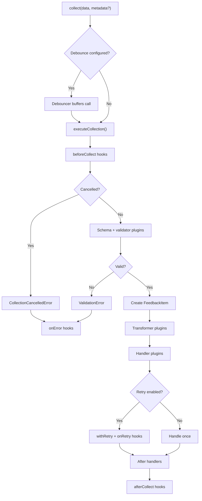

# @devozaar/feedback-core

A framework-agnostic, headless TypeScript library for collecting feedback. Zero opinions on UI—maximum extensibility.

## Features

- 🎯 **Headless** - No UI components, works with any frontend framework
- 🔧 **Generic** - Handles any feedback type (ratings, NPS, surveys, custom)
- 🔌 **Extensible** - Plugin system for validators, transformers, and handlers
- ✅ **Type-Safe** - Full TypeScript support with Zod schema validation
- 🔄 **Resilient** - Built-in debouncing and retry with exponential backoff

## Installation

```bash
npm install @devozaar/feedback-core zod
```

> **Note**: `zod@^4.0.0` is a peer dependency.

## Quick Start

```typescript
import { FeedbackCollector, ConsoleHandler } from "@devozaar/feedback-core";
import { z } from "zod";

// Define your feedback schema
const NpsSchema = z.object({
  score: z.number().min(0).max(10),
  comment: z.string().optional(),
});

type NpsScore = z.infer<typeof NpsSchema>;

// Create a collector
const collector = new FeedbackCollector<NpsScore>({
  type: "nps",
  schema: NpsSchema,
});

// Add handlers
collector.use(new ConsoleHandler());

// Collect feedback
await collector.collect({ score: 9, comment: "Great product!" });
```

## Code Flow Summary

**Simple flow overview**

- `collect()` is the single entry point.
- Optional debouncing buffers rapid submissions.
- `beforeCollect` hooks can short-circuit collection.
- Schema + validator plugins validate input.
- A `FeedbackItem` is created and transformed.
- Handler plugins run (optionally with retry + `onRetry` hooks).
- `afterCollect` hooks run on success.
- Any error triggers `onError` hooks with a phase hint.



## Default Behaviors

If you don’t register plugins or handlers, `collect()` still runs and returns a `FeedbackItem`, but the system stays silent.

- **Handlers**: none by default — no side effects happen unless you register a handler.
- **Validators**: if no schema and no validator plugins are provided, validation passes.
- **Transformers**: none by default — the item is returned unchanged.
- **Retry**: only applies when handlers exist and throw errors.
- **Metadata**: `defaultMetadata` is merged with per-call metadata (per-call wins).
- **Hooks**: `beforeCollect`, `afterCollect`, and `onError` still run if registered.

## Configuration

```typescript
const collector = new FeedbackCollector<NpsScore>({
  type: "nps",
  schema: NpsSchema,

  // Debounce rapid submissions
  debounce: {
    wait: 500, // Wait 500ms after last call
    maxWait: 2000, // Force flush after 2s max
    leading: false, // Fire on trailing edge (default)
  },

  // Retry failed handlers
  retry: {
    attempts: 3,
    baseDelay: 1000,
    maxDelay: 10000,
    backoff: "exponential", // 'exponential' | 'linear' | 'fixed'
    retryOn: (error) => error.message.includes("network"),
  },

  // Default metadata for all items
  defaultMetadata: {
    source: "web",
    sessionId: "abc123",
  },
});
```

## Plugins

### Built-in Handlers

```typescript
import {
  ConsoleHandler,
  MemoryHandler,
  CallbackHandler,
} from "@devozaar/feedback-core";

// Console (development)
collector.use(new ConsoleHandler({ pretty: true }));

// Memory (testing)
const memory = new MemoryHandler<NpsScore>();
collector.use(memory);
console.log(memory.items);

// Callback (custom)
collector.use(
  new CallbackHandler(async (item) => {
    await fetch("/api/feedback", {
      method: "POST",
      body: JSON.stringify(item),
    });
  })
);

// Supabase Example
import { createClient } from "@supabase/supabase-js";

const supabase = createClient("YOUR_URL", "YOUR_KEY");

collector.use(
  new CallbackHandler(async (item) => {
    const { error } = await supabase
      .from("feedback")
      .insert({
        id: item.id,
        type: item.type,
        data: item.data,
        metadata: item.metadata,
        created_at: new Date(item.timestamp).toISOString(),
      });

    if (error) throw error;
  })
);
```

### Custom Plugins

```typescript
import type {
  ValidatorPlugin,
  TransformerPlugin,
  HandlerPlugin,
} from "@devozaar/feedback-core";

// Validator
const profanityFilter: ValidatorPlugin<NpsScore> = {
  name: "profanity-filter",
  type: "validator",
  validate: (data) => {
    const hasProfanity = /badword/i.test(data.comment ?? "");
    return {
      valid: !hasProfanity,
      errors: hasProfanity ? ["Comment contains inappropriate language"] : [],
    };
  },
};

// Transformer
const enricher: TransformerPlugin<NpsScore> = {
  name: "enricher",
  type: "transformer",
  transform: (item) => ({
    ...item,
    metadata: { ...item.metadata, enrichedAt: Date.now() },
  }),
};

// Handler
const analyticsHandler: HandlerPlugin<NpsScore> = {
  name: "analytics",
  type: "handler",
  handle: async (item) => {
    analytics.track("feedback_submitted", item);
  },
};

collector.use(profanityFilter).use(enricher).use(analyticsHandler);
```

## Lifecycle Hooks

```typescript
collector
  .onBeforeCollect((context) => {
    console.log("About to collect:", context.data);
    // Return false to cancel collection
  })
  .onAfterCollect((item) => {
    console.log("Collected:", item.id);
  })
  .onError((error, context) => {
    console.error(`Error in ${context?.phase}:`, error);
  })
  .onRetry((attempt, error, nextDelay) => {
    console.log(`Retry ${attempt} in ${nextDelay}ms`);
  });
```

## API Reference

### FeedbackCollector

| Method                     | Description                    |
| -------------------------- | ------------------------------ |
| `collect(data, metadata?)` | Collect feedback               |
| `validate(data)`           | Validate without collecting    |
| `use(plugin)`              | Register a plugin              |
| `withSchema(schema)`       | Add Zod schema                 |
| `flush()`                  | Force flush debounced items    |
| `cancel()`                 | Cancel pending debounced items |
| `onBeforeCollect(hook)`    | Add before-collect hook        |
| `onAfterCollect(hook)`     | Add after-collect hook         |
| `onError(hook)`            | Add error hook                 |
| `onRetry(hook)`            | Add retry hook                 |

### Types

```typescript
interface FeedbackItem<T> {
  id: string;
  type: string;
  data: T;
  metadata: FeedbackMetadata;
  timestamp: number;
}

interface FeedbackMetadata {
  sessionId?: string;
  userId?: string;
  source?: string;
  [key: string]: unknown;
}
```

## License

MIT
